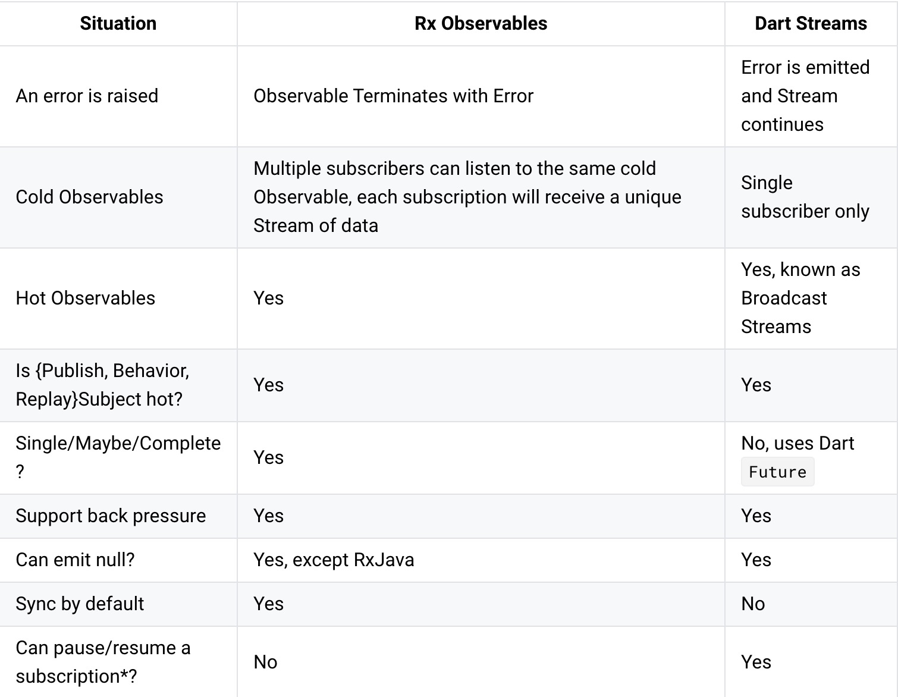

# Stream Transforming & RxDart  
### 1\. 流的转换  
**流可以转换成另外的流**。转换的本质是 **使用输出的流产出一个新的流**。  
Dart 中提供了一部分转换的函数方法，当然也可以自定义转换流的转换器。  
#### 1). 常用的转换方法  
`Stream<S> map<S>(S convert(T event))`，用于映射值：  
```dart
  final Stream<int> sourceStream = Stream.fromIterable([1, 2, 3]);
  
  final Stream<String> transformedStream = sourceStream.map<String>((int i) => 'event$i');
  
  transformedStream.listen(print);
```

`Stream<T> where(bool test(T event))`，用于过滤值：  
```dart
  final Stream<int> sourceStream = Stream.fromIterable([0, 9, 1, 8, 2, 7, 3, 6, 4, 5]);
  
  final Stream<int> transformedStream = sourceStream.where((int i) => i >= 5);
  
  transformedStream.listen(print);
```

`Stream<T> take(int count)`，取几次值：  
```dart
  final Stream<int> sourceStream = Stream.fromIterable([0, 9, 1, 8, 2, 7, 3, 6, 4, 5]);
  
  final Stream<int> transformedStream = sourceStream.take(4);
  
  transformedStream.listen(print);
```
当然，如果想对流进行多重操作，可以组合操作符，比如：  
```dart
  final Stream<int> sourceStream = Stream.fromIterable([0, 9, 1, 8, 2, 7, 3, 6, 4, 5]);
  
  sourceStream
    .where((int i) => i >= 5)
    .take(3)
    .map<String>((int i) => 'event$i')
    .listen(print);
```

#### 2). 自定义转换方法  
当 Dart 中提供的操作方法无法满足自身的需求时，可以使用 transform 方法传入自己定义的转换器。  
```dart
  Stream<S> transform<S>(StreamTransformer<T, S> streamTransformer) {
    return streamTransformer.bind(this);
  }
```
上面 `transform` 方法的定义中， 传入一个转换器 `StreamTransformer` 实例，该实例在执行方法时，将使用 `T` 类型作为输入类型（通过 `bind(this)`），`S` 类型作为输出类型返回，`tranform` 方法则继续返回该转换器输出的类型 `S`。。  
`StreamTransformer` 拥有三种构造方法：  
```dart
  StreamTransformer<T, S>(
    StreamSubscription onListen(
      Stream<S> stream,
      bool cancelOnError
    )
  )
```
第一种， `StreamTransformer` 接收一个 `onListen` 回调函数，这个回调函数接收需要转换的 `Stream` 以及遇到错误是否取消监听的 `flag`，返回一个 新流的 `Subscription`。如下例：  
```dart
  //// Starts listening to [input] and stringify all non-error events.
  StreamSubscription<String> _onListen(Stream<int> input, bool cancelOnError) {
    StreamSubscription<int> subscription;
    // Create controller that forwards pause, resume and cancel events.
    final controller = new StreamController<String>(
        onPause: () {
          subscription.pause();
        },
        onResume: () {
          subscription.resume();
        },
        onCancel: () => subscription.cancel(),
        sync: true); // "sync" is correct here, since events are forwarded.

    // Listen to the provided stream using `cancelOnError`.
    subscription = input.listen(
      (int data) {
        // stringify the data.
        controller.add('event${ data.toString() }');
      },
      onError: controller.addError,
      onDone: controller.close,
      cancelOnError: cancelOnError
    );

    // Return a new [StreamSubscription] by listening to the controller's
    // stream.
    return controller.stream.listen(null);
  }

// Instantiate a transformer:
  final eventStringParser = StreamTransformer<int, String>(_onListen);

// Use as follows:
  final Stream<int> sourceStream = Stream.fromIterable([0, 9, 1, 8, 2, 7, 3, 6, 4, 5]);
  sourceStream.where((int i) => i >= 5)
    .take(3)
    .transform(eventStringParser)
    .listen(print);
```
分析代码后可以发现，`onListen` 方法内部创建了一个 `StreamController`，然后对输入的流进行监听和值的转化，然后返回新流的 `Subsription`。  

```dart
  StreamTransformer<S, T>.fromHandlers({
    void handleData(
      S data,
      EventSink<T> sink
    ),
    void handleError(
      Object error,
      StackTrace stackTrace,
      EventSink<T> sink
    ),
    void handleDone(
      EventSink<T> sink
    )
  })
```
第二种算是比较常用的方法， 其中 `S` 是输入的类型，`T` 是输出的类型，`handleData`，`handleError`，`handleDone` 则分别对应了流状态的三个方法， `sink` 是新生成的流。  
```dart
  int number = 0;
  final StreamTransformer<int, String> eventStringParser = StreamTransformer<int, String>.fromHandlers(
    handleData: (int value, EventSink<String> sink) {
      number++;
      sink.add('sequence: $number, event${ value.toString() }');
    }
  );

  final Stream<int> sourceStream = Stream.fromIterable([0, 9, 1, 8, 2, 7, 3, 6, 4, 5]).asBroadcastStream();
  sourceStream.where((int i) => i >= 5)
    .take(3)
    .transform(eventStringParser)
    .listen(print);

  sourceStream.where((int i) => i >= 5)
    .take(3)
    .transform(eventStringParser)
    .listen(print);

  // output
  // sequence: 1, event9
  // sequence: 2, event9
  // sequence: 3, event8
  // sequence: 4, event8
  // sequence: 5, event7
  // sequence: 6, event7
```
在创建转换器的时候，多播流是可以共享状态的，如上例中的 `number`，每个流在产出值时都会加1。可以利用这一特性配合 `Dart` 中的闭包，将状态封装在函数内，然后再返回转换器，做一些特殊的操作。  
```dart
  @Since("2.1")
  StreamTransformer<S, T>.fromBind(
    Stream<T> bind(
      Stream<S>
    )
  )
```
通过使用 `bind` 方法，将多个转换器组合到一起生成新的转换器，此方法是 `Dart 2.1` 版本才添加的，使用时要注意版本：  
```dart
  final splitDecoded = StreamTransformer<List<int>, String>.fromBind(
    (stream) => stream.transform(utf8.decoder).transform(LineSplitter())
  );
```

---

### 2\. RxDart  
`Rx` 全称 `Reactive Extensions`，是一个基于 `观察者模式` 和 `迭代器模式`，使用 `函数式编程思想` 和 `响应式编程思想` 管理 `序列上的事件` 的库。  
函数式思想体现在 `操作符` 上，响应式思想则利用了观察者模式去体现，而迭代器模式，则体现在一次只产生一个 `event`。  
`RxDart` 则是 `ReactiveX` 在 `Dart` 语言中的实现，它的扩展使对 `Dart` 中流的控制更加方便。  
它对 Stream 做了以下拓展：  
#### 1). Stream Classes  
`Stream Classes` 提供了对流的一些特殊操作，比如将多个流进行 `组合（Combine）`或者 `合并（Merge）`。  
```dart
  /// concat two streams
  final Stream<int> concatedSource = ConcatStream([
    Stream.fromIterable([1, 2, 3, 4]),
    Stream.fromIterable([5, 6, 7, 8])
  ]);

  // ...other data here

  /// listen the concated stream
  concatedSubscrition = concatedSource.listen(print);
```
上例中，通过 `ConcatStream` 方法，将两个流组合在一起生成一个新的流。  

#### 2). Extension Methods  
`Extension Methods` 指的是对流添加了一些 `Dart` 中没有的操作符，比如下例中使用的 `delay` 和 `startWith：`  
```dart
  concatedSubscrition = concatedSource.startWith(0).delay(Duration(seconds: 3)).listen(print);
```
该流在被订阅时，首先会在流的开始添加一个初始值 `0`，延迟 `3s` 后才会将 `event` 传递给监听者。  
操作符是纯函数，它返回了一个监听源流的新流，所以每当对新的流进行监听之后，就会触发源流的监听，然后依次向上，直到触发初始流的监听，事件才会从原始流向下传递。  
```dart
  Stream<T> delay(Duration duration) => transform(DelayStreamTransformer<T>(duration));
```
可以看到操作符本身就是对 `transform()` 的返回。  

#### 3). Subjects  
`Subjects` 是一个由 `rx` 提供的 `StreamController`，它默认生成一个多播流。  
- `BehaviorSubject`  
一个缓存了最后一次 `event` 的多播流。当一个新的监听者监听这个流，它会立即将之前发送过的最后一个值返回给这个监听者。  

- `ReplaySubject`  
一个缓存传入参数数量 `event` 的多播流。当一个新的监听者监听这个流，它会立即将之前缓存过的 `event` 返回给这个监听者。  
```dart
  final ReplaySubject<int> replaySubject = ReplaySubject(maxSize: 3);

  firstSubscription = replaySubject.listen((int event) => print('ListenerA: $event'));
    replaySubject.add(1);
    replaySubject.add(2);
    replaySubject.add(3);
    replaySubject.add(4);
    replaySubject.add(5);

  secondSubscription = replaySubject.listen((int event) => print('ListenerB: $event'));

  //output
  // ListenerA: 1
  // ListenerA: 2
  // ListenerA: 3
  // ListenerA: 4
  // ListenerA: 5
  // ListenerB: 3
  // ListenerB: 4
  // ListenerB: 5
```

`RxDart` 并没有提供它自己的 `Observable` 类，它只是在 `Dart` 的流上进行了以上所说的拓展。下面是原版的 `Rx` 和 `Stream` 的对比。  
  

---

